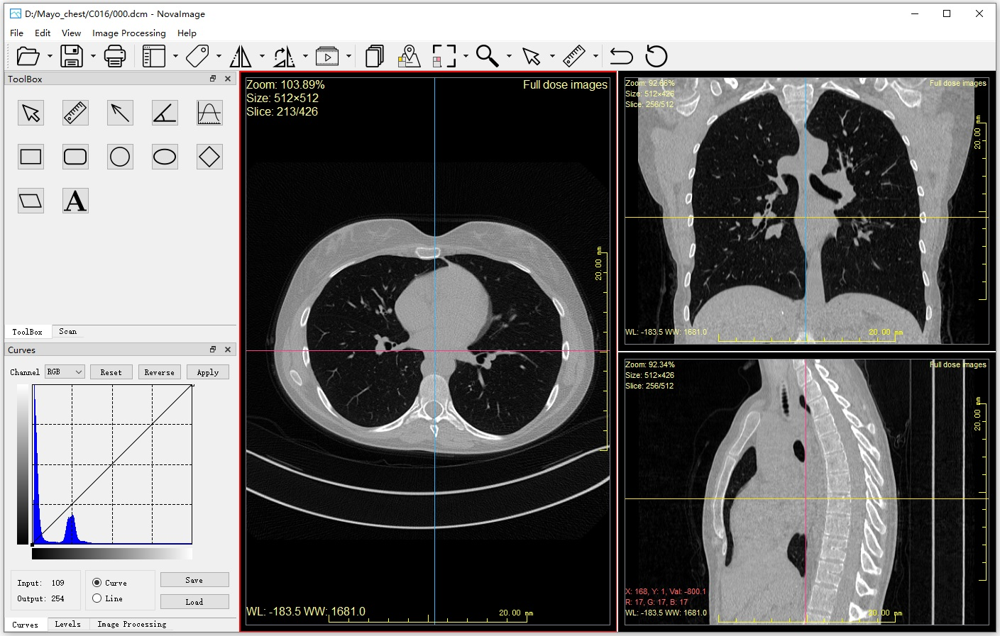

# NovaImage

NovaImage is a cross-platform image processing software which supports viewing common image formats (jpg, png, tiff, gif, etc.) and DICOM images, and supports volume data. NovaImage has built-in rich image processing functions and modules for measurement and labeling, which are convenient and quick to analyze and statistical image information. The software interface is friendly, easy to use, and supports plug-in development.

## Requirements

- [Qt 5.14.2](https://www.qt.io/)
- [DCMTK 3.6.6](https://www.dcmtk.org/)
- [FFTW 3.3](http://www.fftw.org/)

- IDE: Qt Creator 4.11.1/Visual Studio 2017
